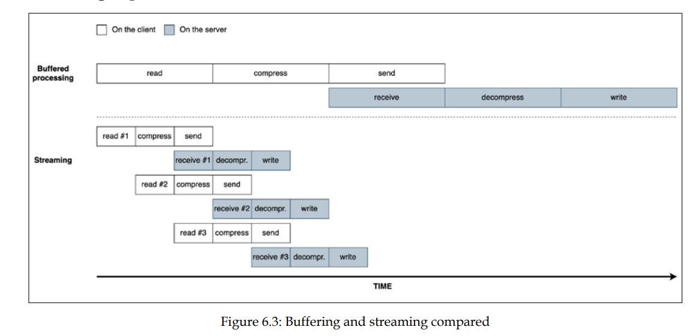

# Streams



## Streams Types

there are 4 types of streams in node.js, and all of them extends the EventEmitter class

### 1. Readable Streams

#### Operating modes

readable streams operate in two modes **Flowing** and **Non-Flowing** mode.
in flowing mode the streams tells you when the data is ready for reading, but you
have to read it yourself

```js
process.stdin
  .on("readable", () => {
    let chunk;
    // data is available
    while ((chunk = process.stdin.read()) !== null) {
      //do something with the data
    }
  })
  .on("end", () => {
    console.log("no more data");
  });
```

in flowing mode the data is pushed to you and you just need to consume it

```js
process.stdin
  .on("data", (chunk) => {
    // do something with the chunk of data
  })
  .on("end", () => console.log("End of stream"));
```

#### Implementing Readable Stream

1. extend _Readable_ stream
2. implement the `_read(size)` function

```js
import { Readable } from "stream";
import Chance from "chance";
const chance = new Chance();

export class RandomStream extends Readable {
  constructor(options) {
    super(options);
    this.emittedBytes = 0;
  }

  _read(size) {
    const chunk = chance.string({ length: size });
    this.push(chunk, "utf8");
    this.emittedBytes += chunk.length;
    if (chance.bool({ likelihood: 5 })) {
      this.push(null);
    }
  }
}
```
